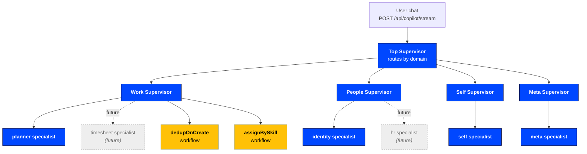
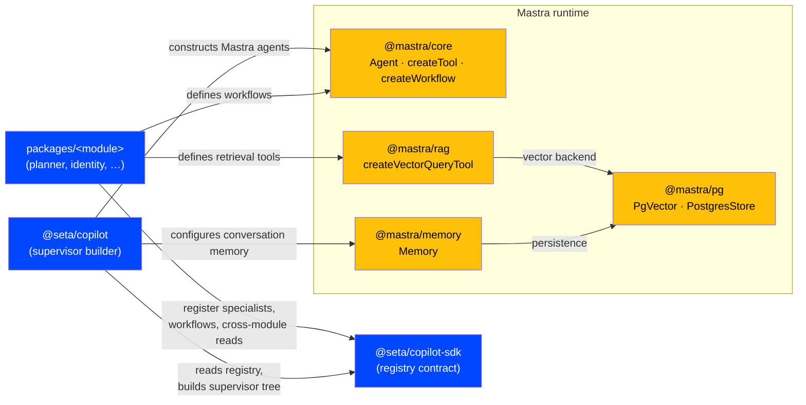
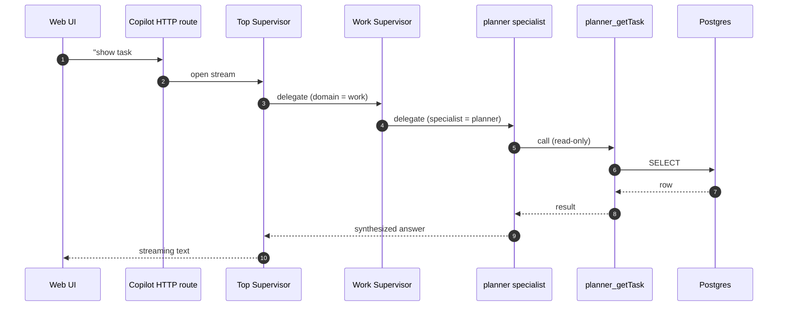
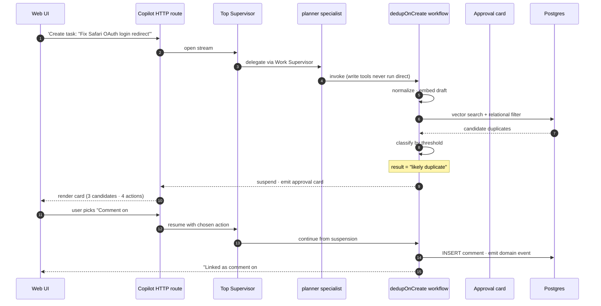
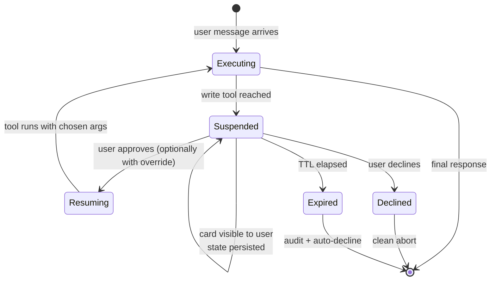
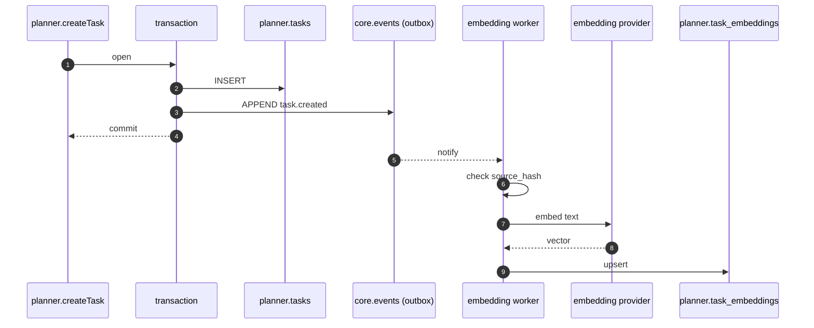

# Copilot agent architecture

*Author: Copilot platform team · Audience: engineering leadership*

This document explains how the Seta copilot works — the system that lets a user say "find someone to take this on" and get a ranked shortlist with one click to assign, or say "create a task for fixing the Safari login" and get caught when that task already exists. It is the implementation reference for the agent layer; for repo-wide architecture, see [`architecture.md`](architecture.md).

---

## The problem we're solving

Knowledge-work platforms reach a point where the friction is no longer *capturing* work, it is *moving* work — answering "is this already tracked?", "who should own this?", "what's on my plate this week?". These are the questions a good chief of staff answers all day. They are also the questions the platform already has every signal to answer: task graph, skill profiles, availability, history, capacity.

An AI assistant is the natural surface for those questions. But to feel like a chief of staff and not a chatbot, it has to do three things that most LLM products skip:

1. **Route confidently across the whole platform.** A real question often spans modules: planner state, identity skills, calendar capacity. The assistant cannot say "I only handle planner queries."
2. **Stay deterministic where the user cares.** Suggesting an assignee is fine to be probabilistic; actually assigning the ticket is not. Every state change is gated by an approval card that shows the user exactly what is about to happen and why.
3. **Stay maintainable as the platform grows.** Six months from now the platform will have a timesheet module, an HR module, a finance module. Each of those will want to expose its own data and actions to the assistant. The system has to absorb them without anyone rewriting the assistant.

The architecture below is shaped around those three requirements.

---

## How a user experiences it

A planner user types "*who should take on the OAuth redirect task?*" into the chat panel. Within a few seconds an approval card appears: three suggested teammates, each with skills, current task load, and remaining hours this week. The user clicks "Assign to Carol". The card collapses, the ticket updates, an audit row is written, and the assistant confirms in one line.

A different user clicks "+ New task" and types a title. Before the task lands, the assistant asks: *"This looks similar to #142 'Safari login broken after OAuth' — comment there, create a related task, or proceed anyway?"* The user picks "Comment there", a comment lands on the existing ticket, and the team's noise level stays low.

Both interactions share the same shape: the assistant *proposes*, the user *decides*, the platform *records*. That shape is the contract we promise. The rest of this document explains how we honor it.

---

## The shape of the system

There are three layers, no more.

**The Top Supervisor** is a router. Its only job is to pick a *domain* — Work, People, Self, or Meta — based on what the user is asking about. It is intentionally narrow: it never reads data, never makes decisions, never executes tools itself. We chose this design because routing accuracy collapses once a single supervisor is asked to know about more than about ten things. With a top-level domain layer, the Top Supervisor's universe stays small even as the product grows to dozens of modules.

**Domain Supervisors** are coordinators within a domain. Work knows about planner, pmo, timesheet. People knows about identity, hr. Each domain supervisor holds two kinds of children: *specialists* (which act on a single module) and *workflows* (deterministic multi-step procedures we will describe below). When a question is single-module ("show me task #142"), the domain supervisor delegates to a specialist. When it is a known multi-step job ("create task X" — which needs deduplication, which needs vector search, which needs HITL), it invokes a workflow.

**Module Specialists** are where module-specific intelligence lives. The planner specialist knows the planner's tools. The identity specialist knows identity's. Critically, specialists can also *read across modules* — the planner specialist can ask "how many hours does this user have free this week?" without bouncing back up to its supervisor — because cross-module reads are published into a shared registry that any specialist may consume. State *changes* never cross that line: only the owning module's specialist can write to its own data.

This separation — writes are private, reads are shared — is the design choice that lets a chat answer about "should I take this on?" satisfy a single delegation hop instead of three, while preserving clean module ownership and an unambiguous audit trail.

---

## Why we build on Mastra

We did not write our own agent runtime. The space — agent hierarchies, tool calling, streaming, suspension/resume for human-in-the-loop, workflow orchestration, vector retrieval, memory persistence — is well-explored, and writing it from scratch would be a year of work for no product differentiation.

We chose [Mastra](https://mastra.ai) because it gives us all of the above as composable TypeScript primitives, with an unusually clean surface for the two things that matter most to us: **hierarchical supervisors with native delegation**, and **first-class human-in-the-loop**. Mastra exposes both as core constructs, not afterthoughts.

Our job is to bring the business: which modules exist, what tools each one exposes, which deterministic flows are worth promoting from "agent reasoning" to "workflow", and how the approval cards should look. We *do not* extend Mastra; we configure it.

The map below shows where our code ends and Mastra begins.

A few things to notice about this picture.

First, **modules never import the agent engine** and the engine never imports modules. They communicate exclusively through the registry. This is the same modular-monolith discipline that runs through the rest of the codebase, applied to the agent layer.

Second, **the registry is the seam where new modules plug in**. Adding the timesheet module someday means writing one registration file in the timesheet package — no edits to copilot, no edits to other modules. The supervisor tree rebuilds on the next process restart with timesheet's specialist, tools, and any cross-module reads it chose to publish.

Third, **the four Mastra packages each do one thing**. Core provides agents, tools, and workflows. RAG provides vector retrieval with built-in filtering and reranking. The Postgres adapter provides both the vector store and the persistence layer for conversation memory and suspended workflow runs. Memory provides the thread-and-message abstraction. We use them as-shipped; we do not vendor or patch them.

---

## How a request flows

Two sequence diagrams are enough to understand the runtime. The first shows the everyday case — a read-only question. The second shows the case that defines the system's character — a write with human approval.

### A read-only question

The request travels through three agents, the deepest specialist runs one tool, and the answer streams back. There is no approval, no suspension, no workflow — reads are cheap and direct.

### A write with human approval

The shape worth noting: the write tool *never executes silently*. The workflow runs the deterministic prologue (normalize, embed, search, classify), then **suspends** the moment it has enough information to ask the user. The suspension is not a custom mechanism — it is Mastra's native approval primitive, which we surface as a typed card in the UI. When the user acts, the run resumes from exactly where it paused.

This is what we mean by "the agent proposes, the user decides, the platform records." Every write in the system follows this shape.

---

## The two flagship workflows

Workflows are how we keep multi-step operations deterministic and auditable. We use them in two cases that define the assistant's value: catching duplicate tasks at creation time, and suggesting an assignee for a task that needs one.

### Catching duplicates as they appear

Duplicates are the silent tax on any work-tracking system. Three engineers file three tickets about the same broken Safari login over a week; the team discovers it later when reviewing the backlog, by which point three people have done the same triage three times. The cost is real but invisible.

The workflow does the obvious thing: every time a task is about to be created through the copilot, we run a semantic search against the tenant's recent tasks. If the new title and description are close to an existing one, we surface the matches with a card that lets the user comment on the existing task, file as related, file as a sub-task, or proceed anyway. If nothing close exists, we create directly and the user never sees a card.

The two judgments — "close enough to matter" and "close enough to definitely be a duplicate" — are tunable per tenant. A consulting firm with many similar-but-distinct client tickets will want looser thresholds than a product team where duplicates are usually true duplicates. We do not hardcode them. Adjusting them is a database update, not a deploy.

Batch imports (CSV, MS Planner sync) run the same logic in a log-only mode: no card, just a metric the team can review. We do not want a thousand approval cards to drop on a user the first time they import.

### Suggesting an assignee

Assignment is where the platform's data pays for itself. Every signal needed to pick a good assignee is already there: skill tags on the user profile, current task load, this week's free hours, timezone overlap with the deadline.

When the workflow fires — whether from a chat question, automatically after a task is created without an assignee, or from a "Suggest assignee" button on the planner page — it does five things in order. It loads the task. It builds a candidate pool from two parallel sources: a fast exact-skill-overlap query against the user table, and a fuzzy semantic match against user-profile embeddings. The two sets are merged on user id, so a candidate found by both signals gets credit for both. It then enriches each candidate with current task count, free hours this week, and timezone — each fetched through a cross-module read tool, so the workflow has no idea which modules supplied which data. It ranks with a weighted score (the weights are per-tenant tunable), keeps the top five, and surfaces them with a card.

The user assigns with one click, picks an alternate from the card, types in someone else through a typeahead, or declines and leaves the task unassigned. There is no auto-assignment mode. The agent suggests; the user assigns.

The workflow also degrades gracefully as the platform grows. If the timesheet module is not installed in a particular deployment, the capacity column simply shows "?" and the score weights load against the current count alone. If a user has no embedding row yet, the exact-overlap branch still finds them. If the task has no skill tags, the vector branch carries via the description. We did not design these fallbacks as an afterthought — they are how the workflow remains useful in a half-built product.

---

## The human-in-the-loop contract

Every write tool in the system requires approval. There is no inline-confirmation pattern, no "trusted writes," no exceptions for low-risk operations. We made this rule absolute on purpose: the moment one write tool gets to bypass the card, the audit story breaks and the user's mental model breaks with it.

The mechanism is straightforward. A write tool marks itself as requiring approval. Mastra suspends the run at the moment of the call. The suspension event bubbles up through whatever depth of supervisors and workflows it sits inside, and lands in the chat thread as a typed *approval card*. The card has a primary action, zero or more alternates (each of which patches the tool's arguments — this is how "Assign to Bob instead of Alice" works), and a decline option. The user's choice resumes the run with the chosen arguments, or aborts it cleanly.

A small set of card layouts covers every case we have today: a plain text description, a key-value table, a candidate list (used by both dedup and assignment), a before/after diff for edits, and a confirmation checklist for destructive operations. New write tools pick one of these layouts; the rendering is already built.

Approval cards persist. A user can refresh the page, log out, return the next morning, and the pending decision is still there. Approvals have a tenant-configurable time-to-live — by default seventy-two hours — after which they auto-decline with an audit row. We did this because operational reality includes Friday-afternoon questions that get answered Monday morning.

The contract for the rest of the platform is also small: anything that writes goes through this card. Slack notifications and email integrations are intentionally not in scope for the v1 — when they land, they will be *surfaces* on the same approval primitive, not separate approval paths.

---

## Retrieval — why we trust vectors for this

Vector search has a reputation for being either magic or unreliable, mostly because teams use it for the wrong shape of problem. We use it for one thing: *fuzzy match where exact match would miss*. That is dedup ("Safari login broken" versus "OAuth redirect Safari"), and that is skill matching ("OAuth experience" finds users tagged "auth" but not "oauth"). Everything else — IDs, status, dates, exact tags, RBAC — stays in Postgres where it belongs.

Concretely: tasks and user profiles each have a sibling embedding table in the same module's schema. A change to the source row emits a domain event through the transactional outbox; an embedding worker (a subscriber, same mechanism every other event uses) reads the source, computes the embedding, and writes the vector row. The worker is idempotent on event id, skips re-embedding when a source-hash matches, and respects model-version columns so a future embedding-model upgrade is a backfill, not a panic.

Queries are *always hybrid*: a Postgres filter (tenant, status, date window) is pushed into the same call as the vector search, and the reranker — a small LLM, weights tunable per tenant — produces the final ordering. We do not run pure vector search at any point in the system. A scoring formula does not get hand-written either; Mastra's reranker handles it.

The Knowledge domain (documents, wiki, files) is intentionally not part of v1. When it lands, it will use Mastra's graph-RAG and document-chunker primitives. We have committed to not reinventing that surface either.

---

## Operational story

A few things are worth understanding about how this runs in production.

**Audit lives in one place.** Every approval, decline, timeout, and tool call writes a row to `core.events`, the same outbox the domain events use. There is one chronologically-ordered tape of everything the platform has done. This is what we hand to compliance review, to incident response, and to the customer when they ask "why did the assistant assign this to Carol?"

**Observability is per-layer.** Latency and token cost are measured at the top supervisor, each domain supervisor, each specialist, each workflow step, each tool. When the user reports "the assistant feels slow", we can name the layer, not guess. The traces export to OpenTelemetry; the dashboards live in Grafana alongside the rest of the platform.

**Conversation state persists.** Mastra's memory layer is configured against our Postgres, scoped to the `copilot` schema. A user closing the tab and reopening it picks up the thread. A supervisor process restarting mid-approval finds the suspended run on disk. There is no in-memory state we would lose to a restart.

**Safety rails sit on top of delegation.** Mastra exposes hooks at the start and end of every delegation. We use them for three things: depth-capping (no more than four hops top-to-leaf), loop detection (the same agent twice in a single run is a bug), and per-tenant step budgets (a runaway agent gets aborted with a structured error, never a wall-clock timeout).

**Evaluation is continuous.** Three layers of tests run on every PR and nightly. Tool-level integration tests use a real Postgres via testcontainers. Workflow tests replay golden traces and verify dedup precision and recall against a labeled corpus. Agent-level tests run a fixture set of fifty routing prompts and twenty end-to-end chat flows; we gate merges on pass rate.

---

## How this absorbs the next module

The product roadmap names timesheet, PMO, finance, HR, and knowledge as modules that will land over the next year. None of them require changes to the copilot package.

Adding a module means three things, and only three things. The module declares which domain it belongs to (it picks one of the four). It registers a specialist with its own tools. If it has reads other modules will want — capacity for timesheet, budget for finance — it publishes those reads to the shared cross-module registry with the RBAC they require. After a process restart, the supervisor tree has a new sub-agent under its domain, the routing prompt mentions the new domain blurb, and the existing specialists can consume the new reads. Nothing else moves.

This is the property we designed for: a growing product surface should be additive work for the team that owns each module, not a coordination tax on the copilot team. The registry is the seam that makes that property hold.

---

## What's deferred, and why

We chose not to ship a few things in v1 because they add complexity that the user does not yet feel.

We do not run dedup on *updates* to tasks, only on creation. Updates are too noisy a signal — a user editing a title repeatedly should not see a card on every keystroke. The metric to un-defer is whether duplicate creation rate stays meaningfully above zero after dedup-on-create lands.

We do not yet have a Knowledge domain. RAG over documents is a substantial slice of its own, with chunking, embedding, ingestion, and a different retrieval surface; pulling it forward would have delayed the entire system.

We do not run a learning loop yet — the user's accept/reject choices on the assignment card do not feed back into the scoring weights. We will add this once the eval infrastructure for LLM-as-judge quality scoring is in place.

We do not surface approvals in Slack or email. Once the in-app card pattern is stable and the on-call rotation has Slack as a primary surface, we will extend the same primitive — not build a parallel path.

A complete deferred-work table lives in the originating spec at `docs/superpowers/specs/2026-05-25-supervisor-refactor-umbrella-design.md` §12.

---

## References

- **Spec**: `docs/superpowers/specs/2026-05-25-supervisor-refactor-umbrella-design.md` — the design this architecture implements.
- **Plans**: `docs/superpowers/plans/2026-05-25-supervisor-refactor-pr{1,2,3}-*.md` — the three-PR rollout.
- **Mastra**:
  - [Supervisor agents](https://mastra.ai/docs/agents/supervisor-agents)
  - [Agent approval propagation](https://mastra.ai/docs/agents/agent-approval)
  - [`createVectorQueryTool`](https://mastra.ai/reference/tools/vector-query-tool)
- **Sibling docs**: [`architecture.md`](architecture.md) — repo-wide architecture; [`creating-modules.md`](creating-modules.md) — module scaffold.
